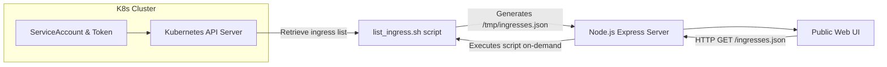

# web-ingress-browser

**web-ingress-browser** is an open-source DevOps tool designed to help you visualize and browse all Kubernetes ingress endpoints in one place. It provides a simple web interface that lists all ingress routes accessible within your Kubernetes cluster, allowing you to quickly identify URLs, namespaces, and hostnames.

---

## About web-ingress-browser

**Key Features:**

- **Aggregated Ingress Routes**: Fetches all Ingress objects from your Kubernetes cluster, listing their hosts and paths.
- **Filtering**: Optional filtering capability (via environment variables) to focus on specific ingress objects by name pattern.
- **Web UI**: Serves a simple, intuitive, and interactive web UI for browsing ingress routes.
- **Open Source**: Fully open-sourced under the Apache 2.0 license. Use, modify, and distribute as needed.

**TL;DR**: Ever wondered what URLs your Kubernetes cluster is serving at scale? With `web-ingress-browser`, you can discover them all at a glance in a web UI.

---

## Architecture and Flow

Below is a conceptual overview of the `web-ingress-browser` architecture:



**Explanation:**

1.  The Node.js server runs inside a Kubernetes pod, having access to a ServiceAccount token and CA cert for the cluster’s API.
2.  On request, it executes `list_ingress.sh` which calls the Kubernetes API to list all ingress objects.
3.  The script outputs a JSON file with all ingress details, which the Node.js server then returns via `/ingresses.json`.
4.  The web UI (served from `public/index.html`) uses AJAX (`$.getJSON`) to fetch and display the ingress data in a user-friendly table.

* * *

Directory Structure
-------------------

```text
ingress-browser/
├─ LICENSE
├─ README.md
└─ src/
   ├─ Dockerfile
   ├─ list_ingress.sh
   ├─ package.json
   ├─ server.js
   └─ public/
      └─ index.html
```

**Key Files:**

*   **`list_ingress.sh`**: A shell script that queries the Kubernetes API server for ingress objects using the service account token.
*   **`server.js`**: A Node.js/Express server that hosts the frontend and provides the `/ingresses.json` endpoint.
*   **`package.json`**: Defines Node.js dependencies and start scripts.
*   **`index.html`**: The front-end web page displaying ingress routes in a table and with a fun 3D animation in the background.

* * *

How to Run Locally (Non-Kubernetes)
-----------------------------------

1.  **Prerequisites**:
    
    *   Node.js (v14 or higher recommended)
    *   `jq` and `curl` if testing outside Kubernetes (script usage may vary)
2.  **Install Dependencies**:
    
    `cd src/ npm install`
    
3.  **Run the Server**:
       
    `npm start`
    
    By default, it runs on `http://localhost:8080`.
    

> **Note**: Running locally without Kubernetes credentials or token will not fetch any real ingresses. You may need to mock or provide a static `ingresses.json` file in `/tmp/`.

* * *

Running in Kubernetes
---------------------

1.  **Container Image**: Build and push the Docker image.
       
    `docker build -t your-repo/web-ingress-browser:latest . docker push your-repo/web-ingress-browser:latest`
    
2.  **Kubernetes Deployment**:  
    Create a Deployment and Service that runs the `web-ingress-browser` image inside the cluster. Provide a `ServiceAccount` with permission to read ingress objects (e.g., using a `ClusterRoleBinding` with `cluster-admin` for testing or a custom `Role` with `Ingress` read permission).
    
    Example (pseudo-manifest):
    
```yaml
apiVersion: v1
kind: ServiceAccount
metadata:
  name: ingress-browser-sa
---
apiVersion: apps/v1
kind: Deployment
metadata:
  name: ingress-browser
spec:
  replicas: 1
  selector:
    matchLabels:
      app: ingress-browser
  template:
    metadata:
      labels:
        app: ingress-browser
    spec:
      serviceAccountName: ingress-browser-sa
      containers:
      - name: ingress-browser
        image: your-repo/web-ingress-browser:latest
        ports:
          - containerPort: 8080
        env:
          - name: FILTER_PATTERN
            value: "my-app" # optional
---
apiVersion: v1
kind: Service
metadata:
  name: ingress-browser
spec:
  selector:
    app: ingress-browser
  ports:
    - port: 80
      targetPort: 8080
```
    
3.  **Accessing the UI**: Once deployed, access the UI via the `web-ingress-browser` service. For example, using `kubectl port-forward`:
    
    bash
    
    Copy code
    
    `kubectl port-forward svc/web-ingress-browser 8080:80`
    
    Then open `http://localhost:8080` in your browser.
    

* * *

Configuration and Environment Variables
---------------------------------------

*   **`FILTER_PATTERN`**: Optional. If set, the `list_ingress.sh` script filters ingresses by name using a regex-like pattern.

*   **`PAGE_TITLE`**: Optional. If set, the UI uses this value for the browser tab title and the main page header. Example:

    ```yaml
    env:
      - name: PAGE_TITLE
        value: "My Ingress Browser"
    ```

    The value is exposed via `GET /config.json` and applied by the frontend on load.

*   **`PAGE_DESCRIPTION`**: Optional. Multiline text shown under the title. Supports Markdown, including Mermaid diagrams (use fenced code blocks with `mermaid`). The UI collapses long descriptions with a “Show more/Show less” toggle.

    Example:

    ```yaml
    env:
      - name: PAGE_DESCRIPTION
        value: |
          Welcome to our ingress browser.
          
          ## Quick Tips
          - Use the search bar to filter
          - Click a host to open it
          
          ### Architecture
          ```mermaid
          graph TD
            A[K8s API] -->|ingresses| B[list_ingress.sh]
            B -->|/tmp/ingresses.json| C[Express]
            C -->|/ingresses.json| D[Web UI]
          ```
    ```

    Notes:
    - Markdown is parsed client-side; diagrams render from fenced blocks labeled `mermaid`.
    - If CDNs are blocked in your environment, vendor `marked`, `dompurify`, and `mermaid` or serve them locally.

* * *

License
-------

This is a fully Open Source tool. Do whatever you want with it.

*   **Apache License, Version 2.0, January 2004**

For more details, see the [LICENSE](LICENSE) file.

* * *

Contact
-------

*   E-mail: info@lukaspastva.sk

Contributions, bug reports, and feature requests are welcome. Enjoy browsing your ingresses!

Copy code
